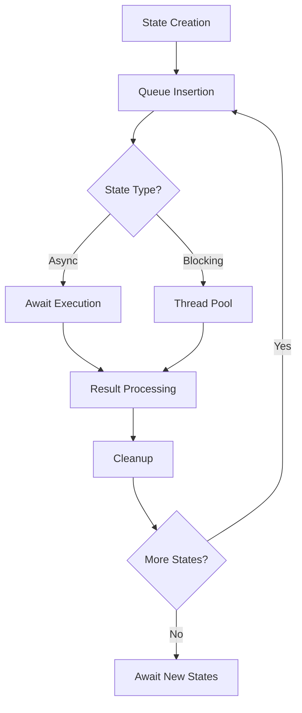

# State Management Module (src/managers/statemanager.py)

## Overview

Implements a state machine pattern for managing application workflow. Handles asynchronous task processing with both
coroutine and thread-based execution models.

Any critical or a service that runs for application runtime should be wrapped in `State` and set `is_blocking` to `True`, this allows other states to run parallely

## Key Components

### 1. State Class

Represents an atomic application state with execution logic

**Attributes**:

```python
name: str  # Human-readable state identifier
func: Callable  # State execution logic
is_blocking: bool  # Indicates long-running operations
lazy_args: tuple  # Dynamically evaluated arguments, evaluated just before state execution
event: asyncio.Event  # Optional execution gate
```

**Key Methods**:

- `enter_state()`: Executes state logic with proper async/thread handling
- `_make_function()`: Prepares execution wrapper based on state type

### 2. StateManager Class (Singleton)

Central coordinator for state processing

**Features**:

- Async queue management
- Task lifecycle tracking
- Graceful shutdown capability

**Core Methods**:

```python
async def process_states():  # Main event loop


    async def put_state():  # Add single state


    async def put_states():  # Add multiple states


    def signal_stopping():  # Initiate shutdown
```

## Core Features

### 1. Execution Model

| State Type      | Handling Method       | Use Case             |
|-----------------|-----------------------|----------------------|
| Async Coroutine | Direct await          | I/O-bound operations |
| Blocking Call   | Thread pool execution | CPU-intensive tasks  |

### 2. Lazy Argument Evaluation

```python
# Arguments can be callables that resolve at runtime
State(..., lazy_args=(lambda: get_dynamic_value(),))
```

### 3. State Transition Control

- Event-based gating (`event_to_wait`)
- Ordered queue processing
- Error wrapping with `wrap_with_tryexcept`

### 4. Observability

- Automatic function name resolution
- Precise event loop timing logs
- Task lifetime tracking

## Usage Example

```python
async def database_migration():


# Async migration logic

def file_processing():


# CPU-intensive processing

# Create states
state1 = State(
    "DB Migration",
    database_migration,
    is_blocking=True
)

state2 = State(
    "File Processing",
    file_processing,
    is_blocking=True
)

# Submit to manager
manager = StateManager.instance()
await manager.put_states([state1, state2])
```

## Important Considerations

1. **Concurrency Model**

    - Async-first architecture
    - Dedicated threads for blocking operations
    - Queue-based execution ordering

2. **Error Handling**

    - Automatic exception wrapping
    - Task cancellation propagation
    - Clean shutdown sequence

3. **Resource Management**

    - Singleton pattern enforcement
    - Task reference tracking
    - Context-aware argument evaluation

4. **Monitoring**

    - Built-in execution timing
    - Function name introspection
    - State transition logging

## Lifecycle Flow



[back](/docs/managers)
