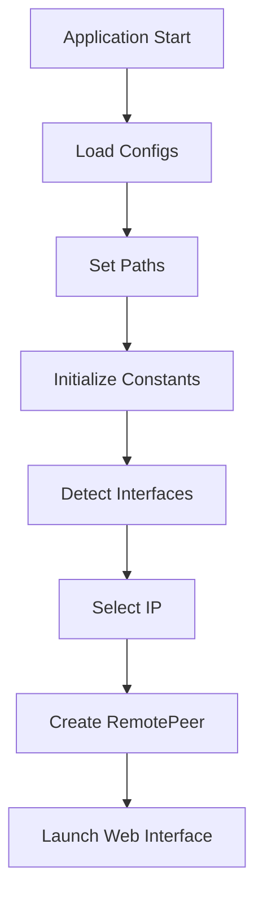

# Network Configuration System

## Overview

Cross-platform system for network interface management and application bootstrapping. Handles:

- Network interface detection
- IP address resolution
- Configuration management
- Application profile handling
- System-specific implementations

## Core Components

### 1. Interface Detection

Platform-specific implementations for network interface enumeration:

#### Linux (`_interfaces_linux.py`) [src](/src/configurations/_interfaces_linux.py)

```python
def get_interfaces() -> list[IPAddress]
```

- Uses `libc` and `getifaddrs`
- Handles both IPv4 and IPv6 addresses
- Filters loopback and inactive interfaces

#### Windows (`_interfaces_windows.py`)  [src](/src/configurations/_interfaces_windows.py)

```python
def get_interfaces() -> list[IPAddress]
```

- Uses Windows IP Helper API
- Retrieves adapter addresses and interface metadata
- Filters non-operational interfaces

### 2. Configuration Management (`configure.py`) [src](/src/configurations/configure.py)

```python
async def load_configs()


    def set_constants()


    def write_default_configurations()
```

**Features**:

- Path initialization (`set_paths()`)
- Config file validation
- Constant initialization
- Default profile creation

### 3. Boot Process (`bootup.py`)  [src](/src/configurations/bootup.py)

```python
async def set_ip_config()


    async def get_ip()


    def configure_this_remote_peer()
```

**Key Functions**:

- IP address selection
- Profile validation
- Remote peer initialization
- Web interface launching

### 4. Fallback IP Detection (`getip.py`)  [src](/src/configurations/getip.py)

```python
async def get_v4()


    async def get_v6()


    async def get_v6_from_shell()
```

**Strategies**:

- Direct socket connections
- System command parsing
- External API fallbacks

## Configuration Flow



## Key Data Structures

### IPAddress Object

```python
class IPAddress(NamedTuple):
    ip: str
    scope_id: int
    if_name: str
    friendly_name: str
```

## Platform Handling Matrix

| Feature             | Linux                                    | Windows              |
|:--------------------|:-----------------------------------------|:---------------------|
| Interface Detection | libc/getifaddrs                          | IP Helper API        |
| IPv6 Scope ID       | sin6_scope_id                            | sin6_scope_id        |
| Default IP Fallback | hostname -I                              | Socket gethostname() |
| Browser Launch      | xdg-open ([WIP](/src_docs/README.md#legend)) | start                |

## Configuration File (`default_config.ini`)

**Key Sections**:

```ini
[NERD_OPTIONS]
ip_version = 6
protocol = tcp
this_port = 3485

[VERSIONS]
global = 1.1
wire = 1.1

[USER_PROFILES]
default_profile.ini
```

## Error Handling

- Multiple IP resolution fallbacks
- Config file validation
- Graceful degradation for:
  - Missing interfaces
  - Invalid profiles
  - Network unavailability

## Observability

- Detailed interface logging
- Configuration version tracking
- Debug mode path printing
- Structured exception handling

## Usage Example

```python
# During application bootstrap
await load_configs()
current_profile = get_current_profile()
await set_ip_config(current_profile)
configure_this_remote_peer(current_profile)
```

## Key Constants Management

```python
# Set in configure.py
const.PROTOCOL = TCP / UDP
const.IP_VERSION = AF_INET / AF_INET6
const.PORT_THIS = 3485
const.PATH_DOWNLOAD = ~ / Downloads / PeerConnect
```

- more [constants](/src/avails/constants.py)

## Diagnostic Tools

```python
print_constants()  # Prints active configuration
print_paths()  # Shows resolved directory paths
reset()  # Re-initializes interface cache
```

## Security Considerations

- Local config file storage
- Limited external API usage
- Sanitized interface input
- Restricted Windows registry access
