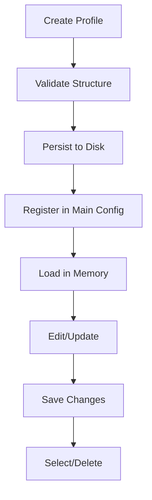

# Profile Management Module (src/managers/profilemanager.py)

## Overview

Manages user profiles and configuration files for the application. Handles profile lifecycle operations including
creation, modification, deletion, and persistence.

`ProfileManager` class works like a profile object and provides profile management functions
All the available profiles are read from `basic_config.ini` (section : `USER_PROFILES`) in [config](/configs/) directory after loading all the profiles, previous selected profile is persisted in `SELECTED_PROFILE` section in main config, all the changes to profile configurations are written when application finalizes.

## Key Features

- **Asynchronous file I/O** using `asyncio`
- **INI file configuration** management via `configparser`
- **Profile versioning** with timestamp-based uniquification
- **Interface configuration** support for network settings
- **Session persistence** with selected profile tracking

## Core Components

### 1. ProfileManager Class

#### Key Properties

```python
username: str  # Profile display name
id: int  # Unique profile identifier
interface: IPAddress  # Network configuration
file_name: str  # Profile config filename
```

#### Main Methods

| Method              | Description                                |
|---------------------|--------------------------------------------|
| `edit_profile()`    | Updates profile sections with new settings |
| `write_interface()` | Specialized method for network config      |
| `add_profile()`     | Classmethod to create new profiles         |
| `delete_profile()`  | Classmethod to remove profiles             |

### 2. Configuration Structure

Profiles are stored in INI format with required sections:

**Example Profile** (`profiles/username12345678.ini`):

```ini
[USER]
name = JohnDoe
id = 42

[INTERFACE]
ip = 192.168.1.100
scope_id = 0
if_name = eth0
friendly_name = Primary
```

### 3. Profile Operations

**Lifecycle Flow**:



### 4. Important Functions

#### `load_profiles_to_program()`

- Initializes profile system
- Loads profiles from disk
- Validates configuration integrity

#### `get_current_profile()`

- Returns active profile
- Maintains session persistence

#### `all_profiles()`

- Returns dictionary of available profiles
- Marks last selected profile

## Usage Example

```python
# Create new profile
new_profile = await ProfileManager.add_profile(
    "NewUser",
    {
        "USER": {"name": "NewUser", "id": 123},
        "INTERFACE": {"ip": "10.0.0.2", "scope_id": 0, ...}
    }
)

# Edit existing profile
await current_profile.edit_profile("USER", {"name": "UpdatedName"})

# Get network config
interface = current_profile.interface
```

## File Management

| Path                     | Description                     |
|--------------------------|---------------------------------|
| `const.PATH_PROFILES`    | Directory for profile INI files |
| `const.PATH_CONFIG_FILE` | Main application configuration  |

[more constants](/src/avails/constants.py)

## Considerations

1. **Concurrency**:

    - Uses async file operations
    - Profile writes are thread-safe

2. **Validation**:

    - Structural pattern matching for config validation
    - Required sections: `[USER]`, `[INTERFACE]`

3. **Uniqueness**:

    - Auto-appends timestamp to profile filenames
    - Prevents naming collisions

4. **State Management**:

    - Maintains class-level profile list
    - Tracks selected profile globally

## Error Handling

- Raises `LookupError` on invalid config structure
- Handles file system errors during deletion
- Fallback to default profile on corruption

[back](/src_docs/managers)
